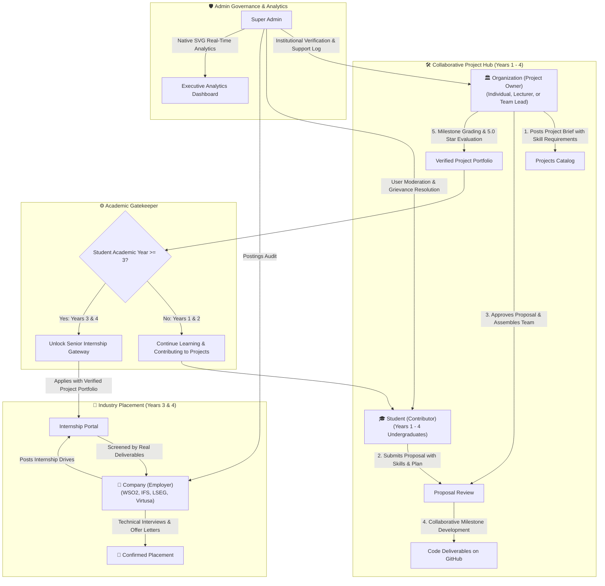

# 🎓 SkillBridge — Project-Driven Skill Development & Industry Gateway Platform

<p align="center">
  
</p>
<p align="center">
  <strong>Bridging the Chasm Between Academic Theory and Industry Reality Through Practical, Project-Based Skill Acceleration.</strong>
</p>

<p align="center">
  <a href="#-about-the-project"></a>
  <a href="#-core-technology-stack"></a>
  <a href="#-core-technology-stack"></a>
  <a href="#-core-technology-stack"></a>
  <a href="#-zero-external-libraries-policy"></a>
  <a href="#-license"></a>
</p>

---

## 📑 Table of Contents
- [🌟 Executive Vision & Core Philosophy](#-executive-vision--core-philosophy)
- [🎯 Primary Focus: Skill Enhancement & Real-World Projects](#-primary-focus-skill-enhancement--real-world-projects)
- [🚀 Additional Feature: Exclusive 3rd & 4th-Year Internship Gateway](#-additional-feature-exclusive-3rd--4th-year-internship-gateway)
- [👥 Four-Tier Ecosystem & User Roles](#-four-tier-ecosystem--user-roles)
- [🏗️ System Architecture & Workflow](#️-system-architecture--workflow)
- [⚡ Key Features Breakdown](#-key-features-breakdown)
- [🛡️ Zero External Libraries Policy (Pure Native Engineering)](#️-zero-external-libraries-policy-pure-native-engineering)
- [📂 Project Directory Structure](#-project-directory-structure)
- [🗄️ Database Schema & Relational Design](#️-database-schema--relational-design)
- [⚙️ Installation & Local Setup Guide](#️-installation--local-setup-guide)
- [🔑 Default Demo Credentials for Evaluation](#-default-demo-credentials-for-evaluation)
- [🔒 Security & Architectural Governance](#-security--architectural-governance)
- [👨‍💻 Team & Academic Contribution](#-team--academic-contribution)

---

## 🌟 Executive Vision & Core Philosophy

In traditional higher education, university computer science and information systems curricula provide rigorous theoretical foundations. However, undergraduate students frequently encounter a **practical experience gap**: they lack opportunities to build complex, multi-tiered applications in cross-functional teams with formal supervisor feedback before graduation.

**SkillBridge** was founded to resolve this systemic disconnect. It is an **all-in-one educational and career development platform** engineered around a continuous, project-based growth cycle.

```
       ┌─────────────────────────────────────────────────────────────┐
       │                THE SKILLBRIDGE LEARNING FLYWHEEL            │
       └─────────────────────────────────────────────────────────────┘
                                      │
            ┌─────────────────────────┴─────────────────────────┐
            ▼                                                   ▼
   [ 1. Skill Acquisition ]                           [ 2. Real-World Projects ]
   Master in-demand tools:                             Form cross-functional teams,
   Full-Stack, Cloud, AI/ML, DevOps                    submit proposals, & build
            │                                                   │
            └─────────────────────────┬─────────────────────────┘
                                      ▼
                      [ 3. Mentor Feedback & Portfolio ]
                      Academic supervisor evaluation,
                      verified certificates, & git deliverables
                                      │
                                      ▼ (Unlocked for 3rd & 4th Years)
                      [ 4. Corporate Internship Gateway ]
                      Direct placement with industry leaders
                      (WSO2, IFS, LSEG, Virtusa)
```

---

## 🎯 Primary Focus: Skill Enhancement & Real-World Projects

The overarching heart and primary objective of SkillBridge is **elevating student technical proficiency and collaborative mastery**:

1. **Practical, Project-Driven Pedagogy:**
   - Rather than passive tutorial reading, students learn by engineering real software solutions proposed by universities and industry partners.
   - Projects span complex domains: Enterprise Web Systems, Mobile Applications, Cloud Infrastructures, AI/ML Pipelines, and Cybersecurity.
2. **End-to-End Proposal & Milestone Workflow:**
   - Students form peer teams (`teams.php`), author formal project proposals (`proposal.php`), and submit milestone deliverables for academic review.
   - Academic supervisors evaluate code architecture, teamwork, and deliverables, providing constructive feedback (`feedback.php`).
3. **Competency-Based Skill Matrix:**
   - Interactive skill dashboards (`skills.php`) allow students to track proficiency levels, earn verified credentials upon project completion, and showcase verified digital certificates (`certificates.php`).
4. **Dynamic Digital Portfolio Showcase:**
   - Every student automatically builds a verified public portfolio (`public_profile.php`) displaying finished projects, verified code repositories, university ratings, and technical badges.

---

## 🚀 Additional Feature: Exclusive 3rd & 4th-Year Internship Gateway

While students in **Years 1 and 2** focus unconditionally on foundational learning, skill development, and project building, SkillBridge introduces an **exclusive, high-impact career gateway**:

> [!IMPORTANT]
> **Strict Academic Year Eligibility Rule:**
> In strict alignment with higher education internship protocols, **the Corporate Internship Gateway is exclusively unlocked for 3rd-Year and 4th-Year undergraduate students.**

```php
// Enforced via check_student_access.php
function canApplyInternship($email) {
    // Queries student academic year from verified database
    $year = getStudentYearNumber($student['year']);
    
    // Strict business validation: Only Year 3 and Year 4 students are eligible
    return $year >= 3;
}
```

### Why This Gated Architecture Matters:
- **Junior Undergraduates (Years 1 & 2):** Protected from premature hiring pressure; dedicated to mastering algorithmic fundamentals, Git workflows, teamwork, and software projects.
- **Senior Undergraduates (Years 3 & 4):** Leverage their completed SkillBridge projects and supervisor certifications to apply directly to verified corporate drives (`internships.php`), bypassing generic resumes in favor of **proven project portfolios**.
- **Corporate Recruiters:** Guaranteed candidates who have already passed university verification, proven team collaboration, and completed tangible software projects.

---

## 👥 Four-Tier Ecosystem & User Roles

SkillBridge is powered by a collaborative synergy between **four distinct actors**:

| Role | Entity Profile | Core Purpose & Workflow in SkillBridge |
| :--- | :--- | :--- |
| 🎓 **Student** | **The Contributor**<br>*(Undergraduates Years 1 – 4)* | • **Access & Identity:** Authenticated directly via official university email (`.ac.lk` / institutional domain).<br>• **Practical Learning:** Explores in-demand skill matrices (React, Python, Cloud, AI, DevOps) and levels up.<br>• **Project Contribution:** Browses projects posted by **Organizations (Project Owners)**, submits proposals (`proposal.php`), and joins as an active **Contributor**.<br>• **Teamwork & Proof-of-Work:** Delivers real code milestones, receives Project Owner ratings, and builds an undeniable public portfolio.<br>• **Senior Gateway (Years 3 & 4 Only):** Unlocks the exclusive gateway to apply for corporate **Internships** posted by Companies. |
| 🏛️ **Organization** | **The Project Owner**<br>*(Individual, Lecturer, Researcher, or Team)* | • **Project Ownership:** Can be an **individual person**, a **university lecturer/professor**, a **researcher**, or an **organized team/club** who owns a software project or research initiative.<br>• **Member Recruitment:** Posts project specifications on SkillBridge, defining required contributor roles (Frontend, Backend, DevOps, UI/UX, AI).<br>• **Proposal Evaluation:** Reviews incoming student proposals (`proposal.php`), shortlists applicants, and forms the project team.<br>• **Project Delivery & Mentorship:** Coordinates deliverables, tracks milestones, and issues ratings/evaluations upon completion (`feedback.php`). |
| 🏢 **Company** | **The Employer**<br>*(Corporate Industry Partners)* | • **Senior Internship Drives:** Posts industrial internship openings **targeted exclusively for 3rd and 4th-year undergraduates**.<br>• **Deliverables-Based Screening:** Discards generic paper resumes; screens applicants by inspecting **real project contributions** completed under Organizations.<br>• **Candidate Funnel:** Coordinates applicant pipeline, schedules technical/behavioral interviews (`interviews.php`), and extends job offers. |
| 🛡️ **Admin** | **The Governor**<br>*(Platform Administrators)* | • **Ecosystem Oversight:** Manages institutional accreditations (UCSC, UoM, Kelaniya, SLIIT), user accounts, and bulk CSV uploads.<br>• **Grievance Resolution:** Investigates and resolves tickets submitted across the platform (`complain.php`).<br>• **Performance Analytics:** Monitors holistic ecosystem metrics using pure native SVG charts (`reportandAnalysist.php`). |

---

## 🏗️ System Architecture & Workflow

<p align="center">
  
</p>

<p align="center">
  <em>🎬 <strong>Interactive 5-Stage Journey:</strong> 1. University Student Onboarding &bull; 2. In-Demand Skill Acceleration &bull; 3. Organization (Project Owner) Posts Projects & Students Contribute &bull; 4. Senior Gateway Unlocked (Years 3 & 4) &bull; 5. Companies Hire Based on Real Deliverables</em>
</p>

<details>
<summary>📐 <strong>Click here to view detailed technical system flowchart</strong></summary>



</details>

---

## ⚡ Key Features Breakdown

### 1. 🎓 Project-Based Learning Hub
- **Proposal Lifecycle:** Students draft structured project proposals outlining architectural scope, tech stack, and milestone delivery dates.
- **Team Synergy:** Built-in team management (`teams.php`) to collaborate with peers across university faculties.
- **Academic Feedback Loops:** Supervisors evaluate code repositories, milestone completion, and architectural quality.

### 2. 💼 Senior Internship Gateway (Years 3 & 4)
- **Automated Year Gatekeeper:** Dynamic server-side validation ensuring only students registered in year 3 or 4 can access job postings.
- **Proof-of-Work Applications:** Applications link directly to the student's verified SkillBridge projects and code repos rather than simple PDF resumes.
- **Interview Suite:** Integrated scheduling for corporate technical and behavioral interviews.

### 3. 📊 Executive Reports & Performance Analytics (Admin)
- **Zero-Dependency SVG Visualizations:**
  - **Dynamic Area & Line Charts:** Monthly application velocity compared against confirmed placements with interactive SVG tooltips.
  - **Institute Donut Chart:** Visual breakdown of active student enrollment across universities.
- **University Benchmark Table:** Performance tracking highlighting **UCSC (Colombo)** at the forefront, followed by **UoM (Moratuwa)**, **University of Kelaniya**, and partner institutes.
- **Multi-Horizon Period Filters:** Seamless instant updates for *Last 30 Days*, *This Quarter (Q3)*, *Year to Date (YTD)*, and *All Time*.
- **Customizable Report Export:** Modal interface to download formatted executive audits in **PDF**, **Excel (.xlsx)**, and **CSV** with optional privacy anonymization.

### 4. ⚖️ Grievance & Complaints Resolution
- Unified ticket resolution system (`complain.php`) handling platform inquiries, academic disputes, and corporate communication with audit timestamps and status management (*Pending*, *Resolved*, *Dismissed*).

---

## 🛡️ Zero External Libraries Policy (Pure Native Engineering)

In strict adherence to academic and performance standards, **SkillBridge uses ZERO third-party libraries, CSS frameworks, or JavaScript CDNs**:

| Area | Traditional Approach | SkillBridge Pure Native Approach |
| :--- | :--- | :--- |
| **Graphical Charts** | Chart.js / Highcharts (Heavy CDNs) | **Pure Native SVG (`<svg>`, `<path>`, `<circle>`)** with mathematical coordinates computed dynamically via native JavaScript |
| **Styling & Layout** | Bootstrap / Tailwind CSS (Pre-built classes) | **100% Handcrafted Vanilla CSS3** with curated CSS custom properties, responsive Grid/Flexbox layouts, glassmorphism, and micro-animations |
| **Client-Side Logic** | jQuery / React / Vue | **100% Native Vanilla JavaScript (ES6+)** with direct DOM manipulation, custom event listeners, and non-blocking toast alerts |
| **Backend Architecture** | Laravel / Symfony Frameworks | **Native Modular PHP 8.2+** with secure Session handling, RBAC guards, and MySQL Prepared Statements |

---

## 📂 Project Directory Structure

```text
Skill_Bridge_Group_Project/
├── Assets/                                # Static web assets
│   ├── CSS/                               # Vanilla CSS stylesheets
│   │   ├── Admin/                         # Admin stylesheets (reports_analytics.css, etc.)
│   │   ├── Company/                       # Employer portal stylesheets
│   │   ├── Organization/                  # University portal stylesheets
│   │   └── Student/                       # Student dashboard & profile stylesheets
│   ├── JS/                                # Native Vanilla JS scripts
│   │   ├── Admin/                         # Admin logic & SVG chart renderers
│   │   ├── Company/                       # Employer interview & screening logic
│   │   └── Student/                       # Skills & project interaction logic
│   └── images/                            # Platform illustrations, avatars, & branding
├── Auth/                                  # Authentication & session controllers
│   ├── login.php                          # Multi-role authentication entrypoint
│   ├── logout.php                         # Secure session invalidation
│   ├── forgot_password.php                # Password recovery mechanism
│   └── reset_password.php                 # Token-based credential reset
├── Backend/                               # Modular business logic controllers
├── Config/                                # Environment & database initialization
│   └── db.php                             # MySQLi database connection instance
├── Functions/                             # Core dashboard implementations by role
│   └── Dashboards/
│       ├── Admin/                         # Super Admin administrative module
│       │   ├── dashboard.php              # Executive platform health metrics
│       │   ├── User_Management.php        # Approvals, bulk CSV imports, & user status
│       │   ├── university.php             # University accreditation audit
│       │   ├── Project_Management.php     # System-wide project governance
│       │   ├── Internship_Management.php  # Industrial openings audit
│       │   ├── complain.php               # Grievance handling & support ticket queue
│       │   └── reportandAnalysist.php     # Pure SVG executive analytics dashboard
│       ├── Company/                       # Industrial partner module
│       │   ├── dashboard.php              # Corporate recruitment overview
│       │   ├── add_internship.php         # Create new internship vacancy
│       │   ├── applications.php           # Screen student applicants
│       │   └── interviews.php             # Candidate interview coordinator
│       ├── Organization/                  # Academic university coordinator module
│       │   ├── dashboard.php              # Faculty projects overview
│       │   ├── manage_projects.php        # Project drafting and publishing
│       │   ├── proposal.php               # Student team proposal evaluations
│       │   ├── feedback.php               # Milestone grading and review notes
│       │   └── reports.php                # Student academic performance exports
│       └── Student/                       # Student development module
│           ├── dashboard.php              # Central student roadmap & stats
│           ├── check_student_access.php   # Year 3 & 4 Internship eligibility gatekeeper
│           ├── skills.php                 # Skill matrix, assessment & progress
│           ├── projects.php               # Browse & join real-world projects
│           ├── teams.php                  # Peer collaboration & team formation
│           ├── portfolio.php              # Showcase completed projects & repositories
│           ├── certificates.php           # Verified credentials and badges
│           └── internships.php            # Senior internship application gateway
├── Includes/                              # Modular layout partials
│   ├── admin_sidebar.php                  # Administrative navigation sidebar
│   ├── dash_header.php                    # Authenticated dashboard top navigation
│   ├── dash_footer.php                    # Shared footer & script inclusions
│   └── header.php                         # Public landing page navigation
├── Session/                               # Session state & security enforcement
│   └── session.php                        # require_login() & require_role() guards
├── index.php                              # Public landing page & platform portal
├── register.php                           # Multi-role self-registration workflow
├── verify-email.php                       # University email token validation
├── mainDb.sql                             # Complete relational database dump
└── README.md                              # Comprehensive project documentation
```

---

## 🗄️ Database Schema & Relational Design

The system is underpinned by a normalized relational database (`skillbridge_db`) comprising 16 interconnected tables:

| Table | Purpose & Relational Connections |
| :--- | :--- |
| `user` | Master authentication credentials, hashed passwords, verification status, and RBAC roles (`student`, `company`, `organization`, `admin`). |
| `student` | Detailed undergraduate records including academic `year` (1 – 4), enrolled `university`, degree, contact info, and verification badge. |
| `organization` | Accredited academic departments, universities, faculties, coordinator contacts, and verification status. |
| `company` | Verified industry enterprise partners, corporate sector, headquarters, contact personnel, and internship sponsorship status. |
| `projects` | Academic and industrial project briefs, requirements, difficulty level, tech stack tags, and deadline timelines. |
| `student_projects` | Pivot table tracking student team assignments, milestone submissions, project completion state, and supervisor evaluations. |
| `skills` | Competency library mapping technical proficiencies (React, Node.js, AWS, Python, Docker) to student progress. |
| `portfolio` | Curated public portfolio items linking completed student deliverables to live demos and GitHub repositories. |
| `certificates` | Digital academic credentials and completion awards issued upon milestone verification. |
| `internships` | Corporate internship vacancies detailing role requirements, eligibility criteria, and job descriptions. |
| `internship_applications` | Applications submitted by eligible 3rd & 4th-year students, candidate status (`Applied`, `Shortlisted`, `Hired`), and interview logs. |
| `complain` | Platform grievance tickets submitted across roles with priority, resolution notes, and audit timestamps. |
| `notifications` | Real-time platform alerts informing users of proposal approvals, interview schedules, and application updates. |

---

## ⚙️ Installation & Local Setup Guide

Follow these steps to deploy and run SkillBridge locally using XAMPP (Apache & MySQL):

### 1. Prerequisites
- **Web Server:** Apache 2.4+ (Included with XAMPP)
- **PHP Version:** PHP 8.2 or higher
- **Database:** MariaDB 10.4+ or MySQL 8.0+
- **Browser:** Any modern web browser (Google Chrome, Firefox, Microsoft Edge, Safari)

### 2. Clone the Repository
Clone the repository directly into your local web server's root directory (`htdocs` for XAMPP):

```bash
# Navigate to XAMPP htdocs directory
cd C:\xampp\htdocs

# Clone repository
git clone https://github.com/harithainduwara05/Skill_Bridge_Group_Project.git

# Enter project directory
cd Skill_Bridge_Group_Project
```

### 3. Import Database
1. Launch **XAMPP Control Panel** and start both **Apache** and **MySQL**.
2. Open your browser and navigate to **phpMyAdmin**: [http://localhost/phpmyadmin](http://localhost/phpmyadmin).
3. Create a new database named `skillbridge_db` with `utf8mb4_general_ci` collation.
4. Select `skillbridge_db`, navigate to the **Import** tab, choose the file [`mainDb.sql`](file:///c:/xampp/htdocs/Skill_Bridge_Group_Project/mainDb.sql), and click **Go**.

### 4. Verify Database Configuration
Ensure [`Config/db.php`](file:///c:/xampp/htdocs/Skill_Bridge_Group_Project/Config/db.php) matches your local database credentials:

```php
<?php 
$host     = 'localhost';
$user     = 'root';
$password = '';             // Default is empty in XAMPP
$dbname   = 'skillbridge_db';

mysqli_report(MYSQLI_REPORT_ERROR | MYSQLI_REPORT_STRICT);
try {
    $conn = new mysqli($host, $user, $password, $dbname);
} catch (Exception $e) {
    die("Database Connection failed: " . $e->getMessage());
}
?>
```

### 5. Run the Application
Open your browser and navigate to:
```text
http://localhost/Skill_Bridge_Group_Project/
```

---

## 🔑 Default Demo Credentials for Evaluation

All demo accounts in [`mainDb.sql`](file:///c:/xampp/htdocs/Skill_Bridge_Group_Project/mainDb.sql) are pre-seeded with the universal password: **`1234`**

| Role | Demo Email Address | Password | Profile / Context |
| :--- | :--- | :--- | :--- |
| 🛡️ **Super Admin** | `skillbridge62@gmail.com` | `1234` | Full system governance, SVG analytics, user approvals & complaints |
| 🛡️ **Admin (Secondary)**| `admin.sarath@skillbridge.lk` | `1234` | Platform operations supervisor |
| 🎓 **Student (Year 4)** | `2024is158@stu.ucsc.cmb.ac.lk` | `1234` | UCSC senior eligible for both Projects and Corporate Internships |
| 🎓 **Student (Junior)** | `2024is120@stu.ucsc.cmb.ac.lk` | `1234` | Undergraduate student focused on projects and skill building |
| 🏛️ **University Org** | `ieee@ucsc.cmb.ac.lk` | `1234` | UCSC Academic Faculty / IEEE Organization (Project Manager) |
| 🏛️ **University Org** | `foss@sliit.lk` | `1234` | SLIIT FOSS Student Organization coordinator |
| 🏢 **Corporate Partner** | `recruitment@wso2.com` | `1234` | WSO2 Talent Acquisition Partner (Active internship drives) |
| 🏢 **Corporate Partner** | `talent@ifs.com` | `1234` | IFS R&D recruiter managing applicant interviews |

---

## 🔒 Security & Architectural Governance

- **Role-Based Session Isolation (`require_role()`):** Every protected dashboard strictly validates authenticated session privileges. Unauthorized cross-role access redirects immediately to login.
- **SQL Injection Prevention:** All dynamic queries across authentication, student application, and admin updates utilize prepared statements (`$stmt->prepare()`) with explicit type binding.
- **Data Privacy & Anonymization:** Student contact details are anonymized in exported analytics reports to comply with digital student privacy standards.
- **Client-Side Validation & XSS Sanitation:** All form inputs sanitize user text and escape output using `htmlspecialchars()` to eliminate script injection vulnerabilities.

---

## 👨‍💻 Team & Academic Contribution

SkillBridge was engineered as a collaborative group initiative to empower university students through technology:

- **Institution:** Academic Undergraduate Group Project
- **Lead Developer & Maintainer:** [Haritha Induwara](https://github.com/harithainduwara05)
- **Project Repository:** [harithainduwara05/Skill_Bridge_Group_Project](https://github.com/harithainduwara05/Skill_Bridge_Group_Project)
- **Year:** 2026

---

<p align="center">
  <sub>SkillBridge &copy; 2026. Designed with dedication to cultivate the next generation of software engineers.</sub>
</p>
